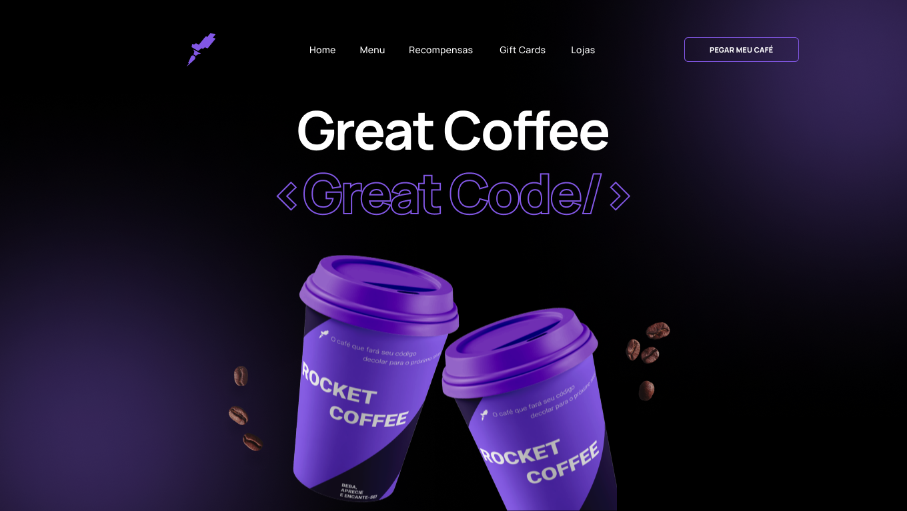

    

  
  
  

  

Neste desafio você deverá desenvolver uma homepage para uma marca de café.

# Instruções

Neste desafio você deverá desenvolver uma homepage para uma marca de café.

Para mais informações acesse o [Notion do desafio](https://efficient-sloth-d85.notion.site/Desafio-RocketCoffee-7802895f0dd44da5a6f71a64badc7e72)
