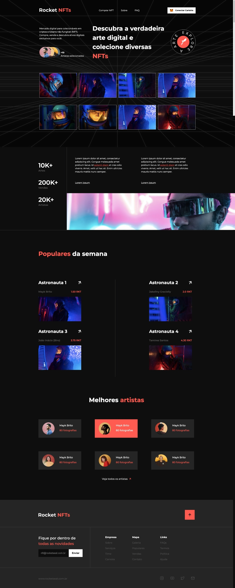

    

  
  
  

  

Neste desafio você deverá desenvolver uma landing page completa sobre NFTs.

# Instruções

Para mais informações acesse o [Notion do desafio](https://efficient-sloth-d85.notion.site/Desafio-Rocket-NFTs-3b5703b9f0e74cb19f34a8bfd14faacb)
