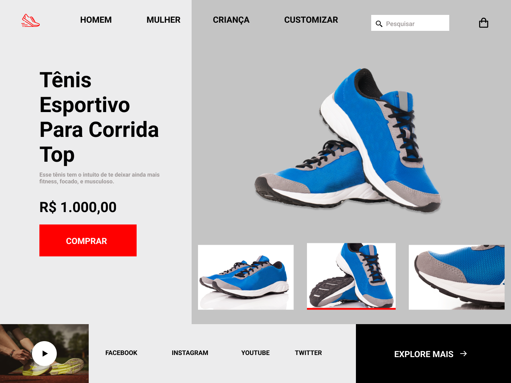

    

  
  
  

  

Neste desafio você deverá desenvolver um mini e-commerce de calçados esportivos.

# Instruções

Neste desafio você deverá desenvolver um mini e-commerce de calçados esportivos.

Para mais informações acesse o [Notion do desafio](https://efficient-sloth-d85.notion.site/Desafio-RocketShoes-c21f2886517b4424a45e13345953cef0)
