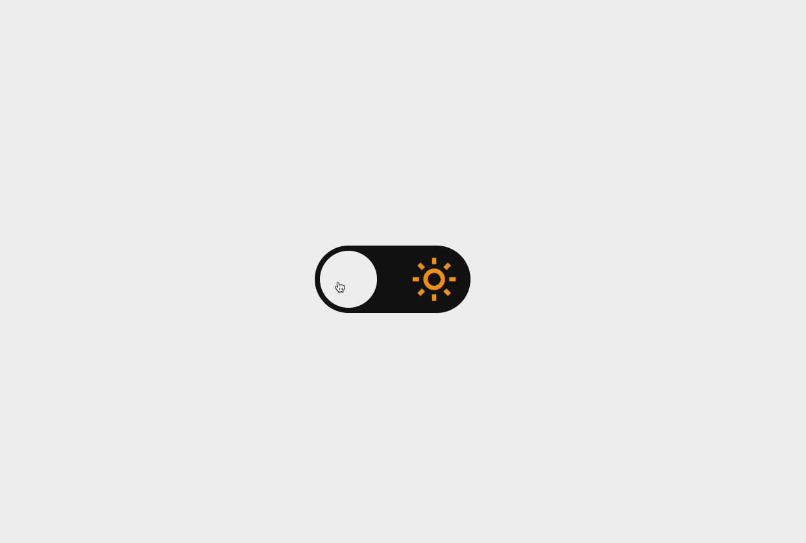

    

  
  
  

  

Nesse desafio você deverá desenvolver uma página que contenha um toggle para alternar entre o tema light e dark.

# Instruções

Nesse desafio você deverá desenvolver uma página que contenha um toggle para alternar entre o tema light e dark.

Para mais informações acesse o [Notion do desafio](#)
